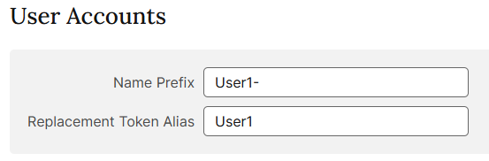
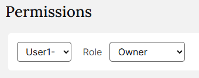
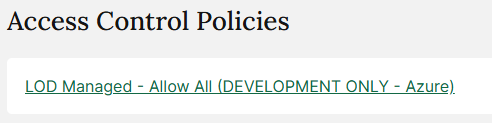
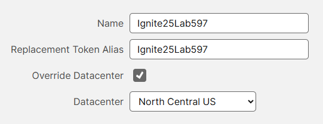
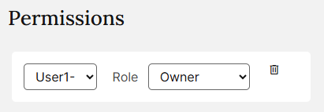
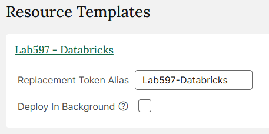

# Lab Setup

## Cloud

### User Accounts

| Setting | Value |
|---------|-------|
| Name Prefix | `User1-` |
| Replacement Token Alias | `User1` |



### Subscription Permissions

#### Permissions

| Setting | Value |
|---------|-------|
| User | `User-1` |
| Role | Owner |



#### Access Control Policies

`LOD Managed - Allow All (DEVELOPMENT ONLY - Azure)`



### Resource Groups

| Setting | Value |
|---------|-------|
| Name | `Ignite25Lab597` |
| Replacement Token Alias | `Ignite25Lab597` |
| Override Datacenter | Yes |
| Datacenter | `North Central US` |



#### Permissions

| Setting | Value |
|---------|-------|
| User | `User-1` |
| Role | Owner |



#### Resource Templates

| Setting | Value |
|---------|-------|
| Template | `Lab597 - Databricks` |
| Replacement Token Alias | `Lab597-Databricks` |
| Deploy In Background | No |

The template is based on an ARM template that deploys an Azzure Databricks workspace and gives it permissions to access the GeoCatalog:

```json
{
  "$schema": "https://schema.management.azure.com/schemas/2019-04-01/deploymentTemplate.json#",
  "languageVersion": "2.0",
  "contentVersion": "1.0.0.0",
  "metadata": {
    "_generator": {
      "name": "bicep",
      "version": "0.38.5.1644",
      "templateHash": "7148562656757428551"
    }
  },
  "parameters": {
    "workspaceName": {
      "type": "string",
      "defaultValue": "Ignite25Lab597"
    },
    "managedResourceGroup": {
      "type": "string",
      "defaultValue": "Ignite25Lab597-Resources"
    },
    "managedIdentityName": {
      "type": "string",
      "defaultValue": "dbmanagedidentity"
    },
    "geoCatalogSubscriptionId": {
      "type": "string",
      "defaultValue": "37d1391e-71d7-4e07-ba62-3b5d8d4e5fbd"
    },
    "geoCatalogResourceGroup": {
      "type": "string",
      "defaultValue": "Lab597_GeoCatalog"
    },
    "geoCatalogName": {
      "type": "string",
      "defaultValue": "Lab597GeoCatalog"
    },
    "location": {
      "type": "string",
      "defaultValue": "northcentralus"
    }
  },
  "resources": {
    "databricksWorkspace": {
      "type": "Microsoft.Databricks/workspaces",
      "apiVersion": "2025-03-01-preview",
      "name": "[parameters('workspaceName')]",
      "location": "[parameters('location')]",
      "sku": {
        "name": "premium",
        "tier": "Premium"
      },
      "properties": {
        "managedResourceGroupId": "[format('/subscriptions/{0}/resourceGroups/{1}', subscription().subscriptionId, parameters('managedResourceGroup'))]",
        "defaultCatalog": {
          "initialType": "UnityCatalog"
        },
        "parameters": {
          "enableNoPublicIp": {
            "value": false
          }
        }
      }
    },
    "databricksManagedIdentity": {
      "existing": true,
      "type": "Microsoft.ManagedIdentity/userAssignedIdentities",
      "apiVersion": "2025-01-31-preview",
      "resourceGroup": "[parameters('managedResourceGroup')]",
      "name": "[parameters('managedIdentityName')]",
      "dependsOn": [
        "databricksWorkspace"
      ]
    },
    "permissions": {
      "type": "Microsoft.Resources/deployments",
      "apiVersion": "2025-04-01",
      "name": "assignPermissions",
      "subscriptionId": "[parameters('geoCatalogSubscriptionId')]",
      "resourceGroup": "[parameters('geoCatalogResourceGroup')]",
      "properties": {
        "expressionEvaluationOptions": {
          "scope": "inner"
        },
        "mode": "Incremental",
        "parameters": {
          "principalId": {
            "value": "[reference('databricksManagedIdentity').principalId]"
          },
          "geoCatalogName": {
            "value": "[parameters('geoCatalogName')]"
          }
        },
        "template": {
          "$schema": "https://schema.management.azure.com/schemas/2019-04-01/deploymentTemplate.json#",
          "languageVersion": "2.0",
          "contentVersion": "1.0.0.0",
          "metadata": {
            "_generator": {
              "name": "bicep",
              "version": "0.38.5.1644",
              "templateHash": "2388760841063374219"
            }
          },
          "parameters": {
            "principalId": {
              "type": "string"
            },
            "geoCatalogName": {
              "type": "string",
              "defaultValue": "Lab597GeoCatalog"
            }
          },
          "variables": {
            "geoCatalogAdminRoleId": "c9c97b9c-105d-4bb5-a2a7-7d15666c2484",
            "roleDefinitionId": "[subscriptionResourceId('Microsoft.Authorization/roleDefinitions', variables('geoCatalogAdminRoleId'))]"
          },
          "resources": {
            "geoCatalog": {
              "existing": true,
              "type": "Microsoft.Orbital/geoCatalogs",
              "apiVersion": "2025-02-11-preview",
              "name": "[parameters('geoCatalogName')]"
            },
            "geoCatalogAdminAssignment": {
              "type": "Microsoft.Authorization/roleAssignments",
              "apiVersion": "2022-04-01",
              "scope": "[format('Microsoft.Orbital/geoCatalogs/{0}', parameters('geoCatalogName'))]",
              "name": "[guid(resourceId('Microsoft.Orbital/geoCatalogs', parameters('geoCatalogName')), parameters('principalId'), variables('geoCatalogAdminRoleId'))]",
              "properties": {
                "roleDefinitionId": "[variables('roleDefinitionId')]",
                "principalId": "[parameters('principalId')]",
                "principalType": "ServicePrincipal"
              }
            }
          }
        }
      },
      "dependsOn": [
        "databricksManagedIdentity"
      ]
    }
  },
  "outputs": {
    "databricksWorkspaceUrl": {
      "type": "string",
      "value": "[reference('databricksWorkspace').workspaceUrl]"
    }
  }
}
```



#### Access Control Policies

`LOD Managed - Allow All (DEVELOPMENT ONLY - Azure)`


## Life Cycle

### Post-Build

#### Add User to GeoCatalog Administrator for static resource

| Setting | Value |
|---------|-------|
| Name | `Add User to GeoCatalog Administrator for static resource` |
| Action | `Execture Script in Cloud Platform` |
| Event | `Post-Build` |
| Blocking | No |
| Delay | 0 |
| Timeout | 10 minutes |
| Repeat | No |
| Retries | 3 |
| Error Action | `Notify User` |
| Error Notification | `An error occurred while attempting to assign your permissions to the GeoCatalog. Please notify the lab proctors to resolve the issue.` |

```powershell
$roles= @('GeoCatalog Administrator')

foreach ($role in $roles) {
New-AzRoleAssignment -SignInName '@lab.CloudPortalCredential(User1).Username' -RoleDefinitionName $role -Scope /subscriptions/37d1391e-71d7-4e07-ba62-3b5d8d4e5fbd/resourceGroups/Lab597_GeoCatalog
}
```

#### Configure Databricks

| Setting | Value |
|---------|-------|
| Name | `Configure Databricks` |
| Action | `Execture Script in Cloud Platform` |
| Event | `Post-Build` |
| Blocking | Yes |
| Delay | 0 |
| Timeout | 10 minutes |
| Repeat | No |
| Retries | 0 |
| Error Action | `Notify User` |
| Error Notification ||

```powershell
$ResourceGroupName = "Ignite25Lab597"

# Get the most recent deployment and extract workspace URL
$deployment = Get-AzResourceGroupDeployment -ResourceGroupName $ResourceGroupName | Select-Object -First 1
$workspaceUrl = $deployment.Outputs.databricksWorkspaceUrl.Value

Set-LabVariable -Name databricksWorkspaceUrl -Value "https://$workspaceUrl"

# Install Databricks CLI
$downloadUrl = "https://github.com/databricks/cli/releases/download/v0.271.0/databricks_cli_0.271.0_linux_amd64.zip"
Invoke-WebRequest -Uri $downloadUrl -OutFile databricks_cli.zip
Expand-Archive -Path databricks_cli.zip -DestinationPath ./cli -Force

# Get Azure AD token for Databricks
$tokenResponse = Get-AzAccessToken -ResourceUrl "2ff814a6-3304-4ab8-85cb-cd0e6f879c1d"

# Configure Databricks CLI
$env:DATABRICKS_HOST = "https://$workspaceUrl"
$env:DATABRICKS_TOKEN = $tokenResponse.Token

# Cluster configuration
$clusterConfig = @{
    cluster_name = "Lab Cluster"
    data_security_mode = "LEGACY_SINGLE_USER_STANDARD"
    single_user_name = "@lab.CloudPortalCredential(User1).Username"
    kind = "CLASSIC_PREVIEW"
    azure_attributes = @{
        availability = "SPOT_WITH_FALLBACK_AZURE"
    }
    runtime_engine = "PHOTON"
    spark_version = "17.2.x-scala2.13"
    node_type_id = "Standard_D4ads_v5"
    spark_env_vars = @{
        OGR_GEOMETRY_ACCEPT_UNCLOSED_RING = "YES"
    }
    autotermination_minutes = 240
    is_single_node = $false
    autoscale = @{
        min_workers = 2
        max_workers = 8
    }
} | ConvertTo-Json -Depth 10

# Create cluster
$cluster = ./cli/databricks clusters create --no-wait --json $clusterConfig | ConvertFrom-Json

# Install libraries
$libraries = @{
    cluster_id = $cluster.cluster_id
    libraries = @(
        @{pypi = @{package = "httpx==0.28.1"}},
        @{pypi = @{package = "azure-identity==1.25.0"}},
        @{pypi = @{package = "aiohttp==3.12.15"}},
        @{pypi = @{package = "geopandas==1.1.1"}},
        @{pypi = @{package = "contextily==1.6.2"}},
        @{pypi = @{package = "planetary-computer==1.0.0"}},
        @{pypi = @{package = "rioxarray==0.19.0"}},
        @{pypi = @{package = "pystac-client==0.9.0"}},
        @{pypi = @{package = "shapely==2.1.2"}},
        @{pypi = @{package = "folium==0.20.0"}},
        @{pypi = @{package = "tqdm==4.67.1"}}
    )
} | ConvertTo-Json -Depth 10
./cli/databricks libraries install --json $libraries

return $true
```
